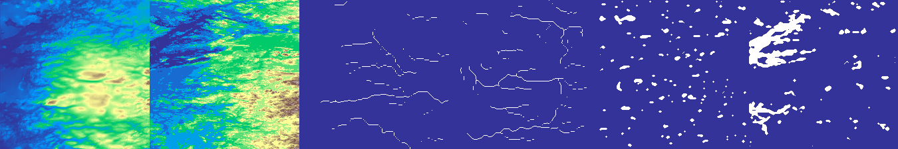
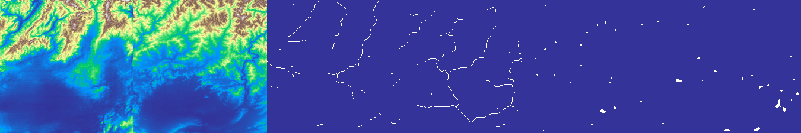
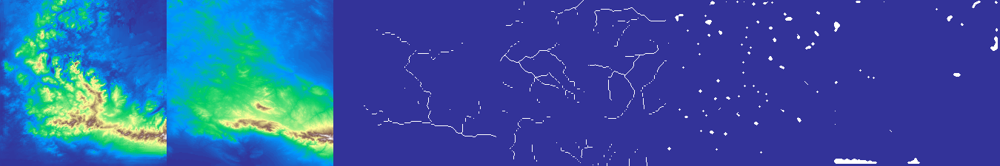
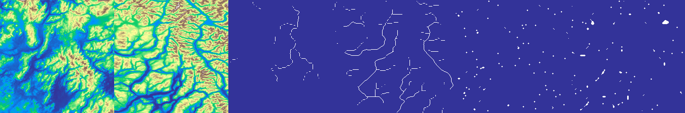
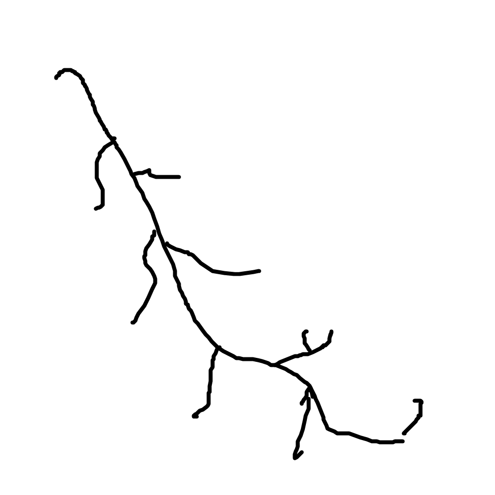
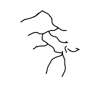
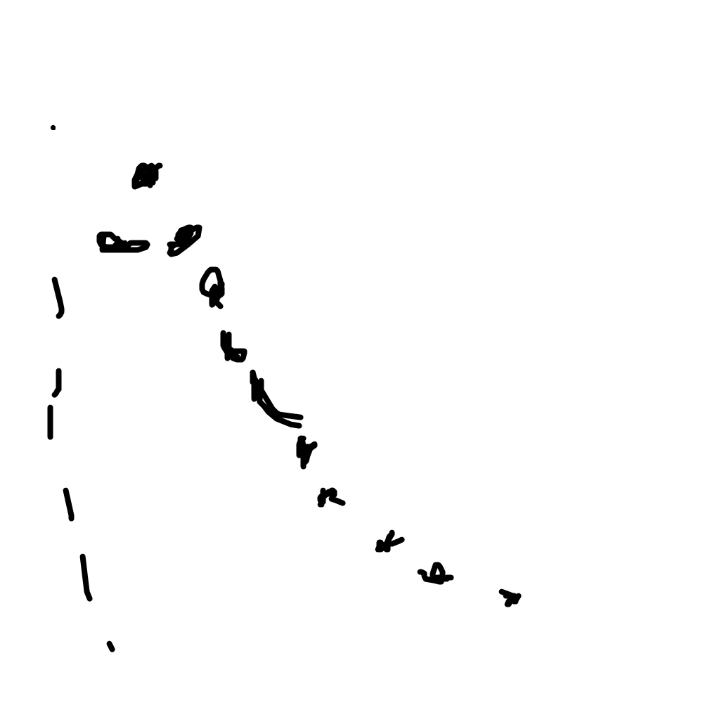
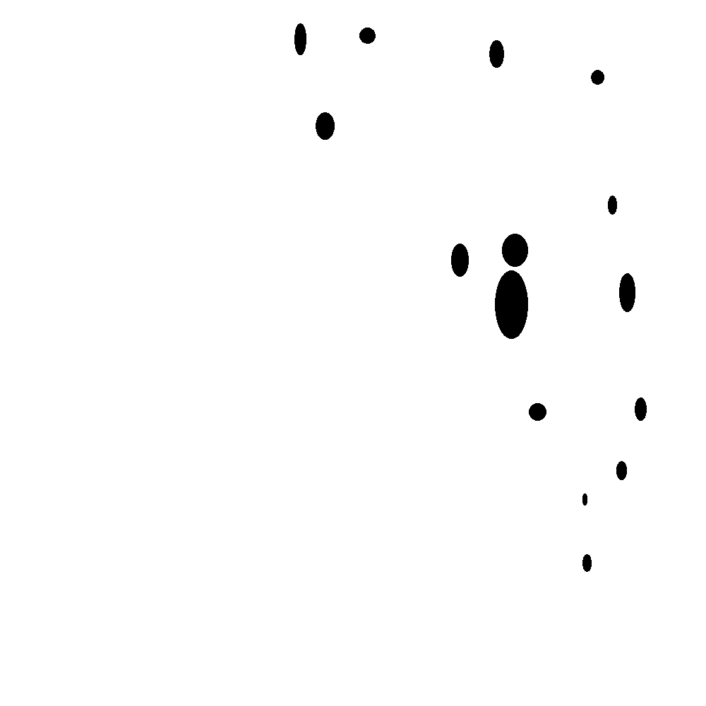
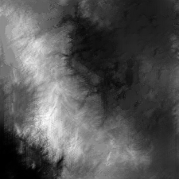
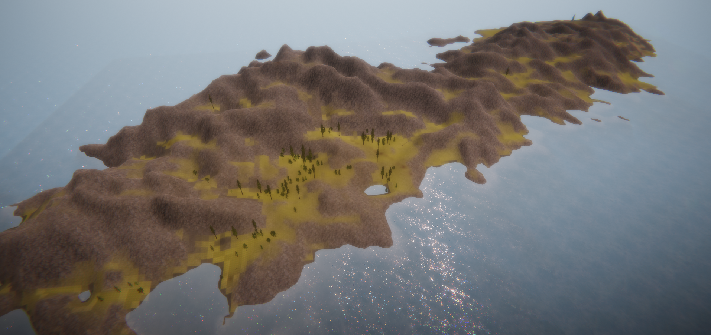

# Sketch to Terrain Pix2Pix #
## Implementation ##
This is my implementation of the following paper. Guérin, Éric, Julie Digne, Éric Galin, Adrien Peytavie, Christian Wolf, Bedrich Benes, and Benoît Martinez. “Interactive Example-Based Terrain Authoring with Conditional Generative Adversarial Networks.” ACM Transactions on Graphics 36, no. 6 (2017): 1–13. https://doi.org/10.1145/3130800.3130804. 

I decided to use Keras with Tensorflow as backend. I used the indications provided by the author in pix2pix, with no BN.
I decided to add noise to the bottleneck of the U-Net to achieve more varability and to provide more stability in training as well.

I used NASA Visible Earth Topography images to to extract the data, and pysheds and georasters to do the corresponding processing. 

PySheds: <https://github.com/mdbartos/pysheds>
GeoRasters: <https://github.com/ozak/georasters>
## Results ##

### Generated image is on the left. Image used to extract the sketches right. ### 
The sketches follow the next nomeclature: ridges, rivers, peaks, basins (see paper for reference)

## Discussion ##
I managed to replicate the results from the paper where I couldn't find the source code. I think the generator can be improved using more recent techniques like the ones I listed below.
Nevertheless, the result is impressive and I want to create a fully procedurally generated Earth using Unity.

## Renders ##
I Used Unity to generate a fully procedural render of the terrains with procedural splatmapping as well. Everything runs live, I will be sharing the code soon!
 Here is the result!

## Future Work ##

- [ ] Try Spectral normalization.
- [ ] Try BatchNorm/InstanceNorm.
- [ ] Find optimal LR.
- [ ] Try different regularizators on the generator loss.
- [ ] Try a Discriminator Ensemble.
- [x] Create renders of the DEMs.
