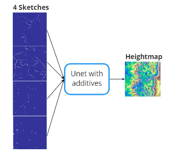
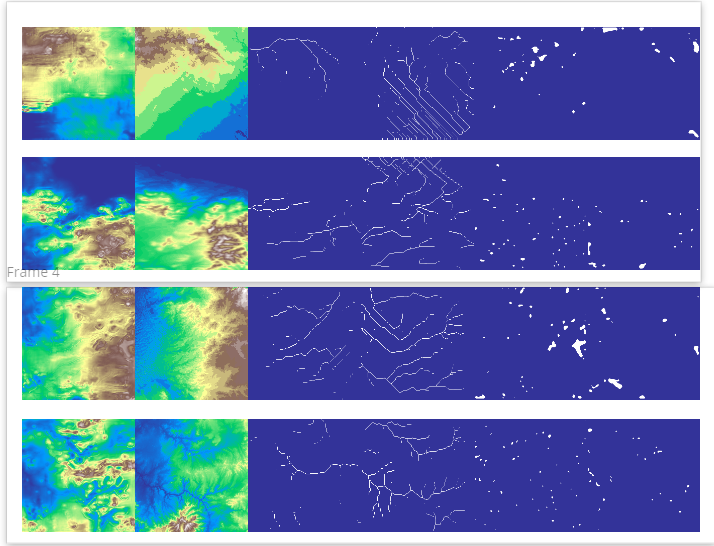
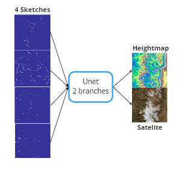
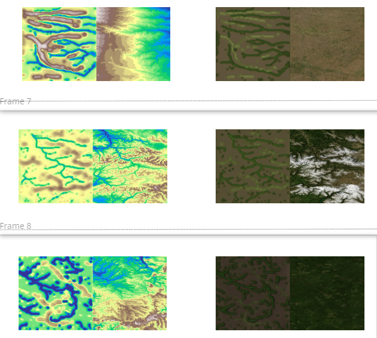
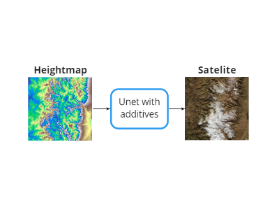
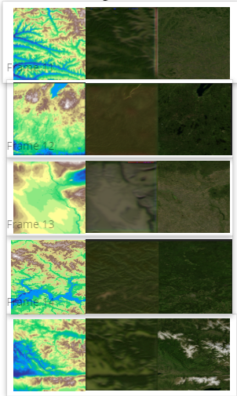
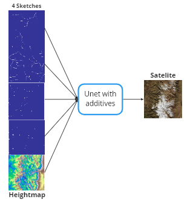
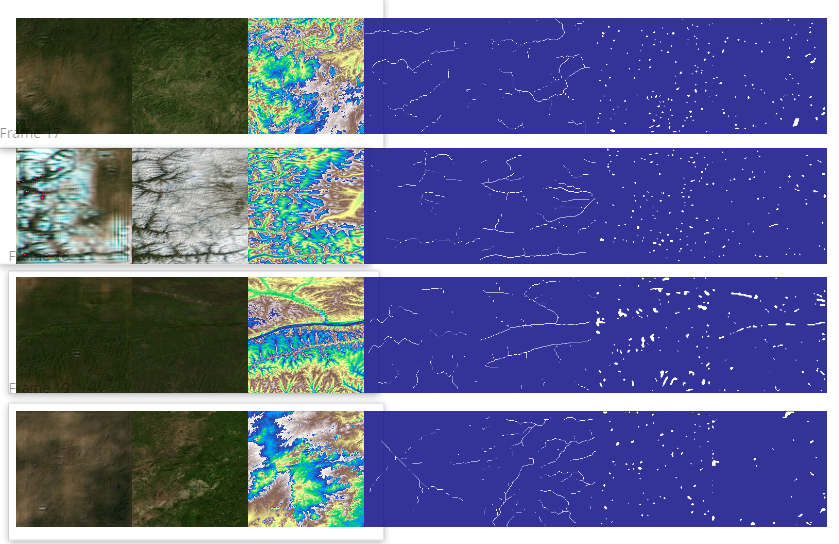

# Sketch to Terrain Pix2Pix #
## Notes on our work ##
This is work build up on nanoxas' implementation of the  following paper. Guérin, Éric, Julie Digne, Éric Galin, Adrien Peytavie, Christian Wolf, Bedrich Benes, and Benoît Martinez. “Interactive Example-Based Terrain Authoring with Conditional Generative Adversarial Networks.” ACM Transactions on Graphics 36, no. 6 (2017): 1–13. https://doi.org/10.1145/3130800.3130804. 

Our contribution:

- Moved the implementation to Tensorflow 2.x.
- Made sure the environment to run the code is easily reproducible, especially code that relates to dataset building (see more in installation page)
- Decoupled data generation from training
- Shared raw initial dataset and preprocessed dataset via DVC
- Added batch and spectral normalization as configurable parameters
- Fixed some non-portable code chunks (e.g related to paths)
- Added  satellite images from September. **This is what we mainly worked on**
- Tested different variation if input-output configuration (see Results section)
- Prepared API with building blocks for further Pix2Pix GAN applications

## Data ##

We  used NASA Visible Earth Topography images to to extract the data, and pysheds and georasters to do the corresponding processing. 
Additionally, we processed satellite images from September and rescale them so that they correspond 1:1 to the heightmap. 

We filtered-out parts of oceans and too-uniform areas.
## Results ##

### Generated image is on the left. Image used to extract the sketches right. ### 
The sketches follow the next nomeclature: ridges, rivers, peaks, basins (see paper for reference)

Here are tested variations:

### Sketch to Heightmap  ###
Model:



Results:



### Sketch to Heightmap & Satellites  ###
Model:



Results:



### Sketch to Heightmap & Satellites  ###
Model:


Results:


### Heightmap to Satellites  ###
Model:



Results:



### Heightmap & Sketches to Satellites  ###
Model:



Results:




## Installation ##
We **stronly** recommend using miniconda for setting up packages related to dataset processing. Especially GDAL that requires several environment paths to be present (`GDAL_PATH`, `GDAL_CONF`) and if you manage your packages via venv you are bound to do it manually. This is especially true for Windows
 
```
conda env create -f environment. yml
```
## API ##

We have prepared scripts for data preprocessing and model training. If, however, you will find yourself in a need to use similar architecture to your own Pix2Pix problem, please have a look at `TerrainGANBuilder` class. This class will let you build your solution in a block-configurable way. 

## Future Work ##

- [ ] use `tf.Data.Dataset` API to save RAM during training
- [ ] try sequential Sketchmap -> Heightmap -> Satellite

